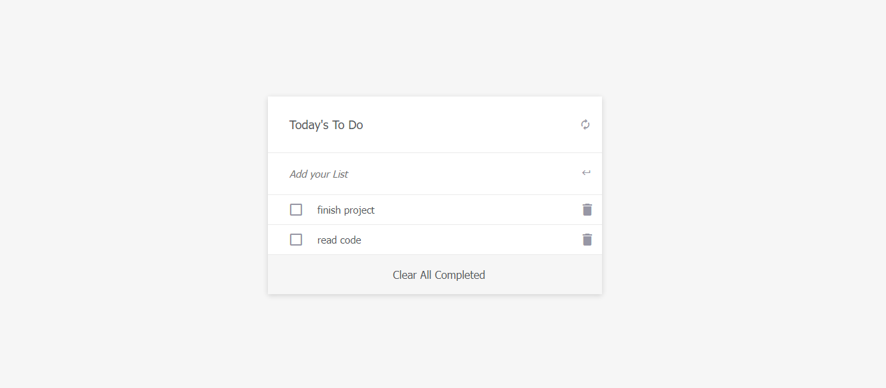

# Project Name
## To do List

In this project, you will build a simple HTML list of To Do tasks. The list will be styled according to the specifications listed later in this lesson. This simple web page will be built using webpack and served by a webpack dev server.

# WORK FLOW SCREEN 
## SCREEN SHOT

## Live Demo
  https://frnega.github.io/To-Do-list/dist/
## Built With
### Major languages
- HTML
- CSS
- Javascript

### Technologies used
- Github
- Git
- Visual Studio Code

## Getting Started
*Instructions on how to access my project locally.**
 To Access my project locally please follow the following instructions;
1. Enter this url: https://github.com/frnega/To-Do-list in your web browser.
2. clone it using git clone and use it on your local repo

## Author
👤 Kalolo Chola Lemba

- GitHub: [@frnega ](https://github.com/frnega)
- 

## 🤝 Contributing
Contributions, issues, and feature requests are welcome!

Feel free to check the issues page.

## Acknowledgments

## Show your support
Give a ⭐️ if you like this project!

📝 License
This project is MIT licensed.
